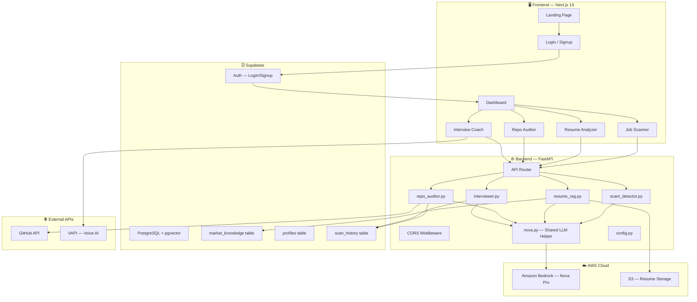
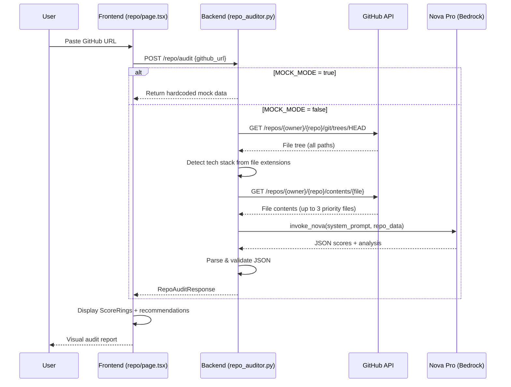

# ARIA: Career Odyssey — Architecture

> System architecture document for hackathon judges and teammates.

## High-Level Architecture

## Data Flow — Repo Auditor (Somya's Feature)

## Team Ownership Map

| Component | Owner | File(s) |
|-----------|-------|---------|
| Landing + Dashboard + Resume UI | Agrani | `page.tsx`, `dashboard/page.tsx`, `resume/page.tsx` |
| Interview Coach (backend + frontend) | Kush | `interviewer.py`, `interview/page.tsx` |
| **Repo Auditor (backend + frontend)** | **Somya** | **`repo_auditor.py`, `repo/page.tsx`** |
| Scam Detector | Archanya | `scam_detector.py`, `jobs/page.tsx` |
| Shared LLM Helper | Kush | `nova.py`, `config.py` |
| AWS Infrastructure | Somya | IAM, Bedrock, S3, `.env` |
| Supabase Schema | Somya | SQL migration |
| Frontend Scaffold | Agrani | Layout, globals.css, components |

## Environment Variables

| Variable | Used By | Source |
|----------|---------|--------|
| `AWS_ACCESS_KEY_ID` | nova.py | IAM Console |
| `AWS_SECRET_ACCESS_KEY` | nova.py | IAM Console |
| `AWS_REGION` | nova.py | `us-east-1` |
| `BEDROCK_MODEL_ID` | nova.py | `amazon.nova-pro-v1:0` |
| `S3_BUCKET_NAME` | resume_rag.py | `aria-resumes-2026` |
| `SUPABASE_URL` | All services | Supabase Dashboard |
| `SUPABASE_ANON_KEY` | Frontend | Supabase Dashboard |
| `SUPABASE_SERVICE_KEY` | Backend | Supabase Dashboard |
| `MOCK_MODE` | All services | `true` / `false` |
| `VAPI_API_KEY` | Interview Coach | VAPI Dashboard |
